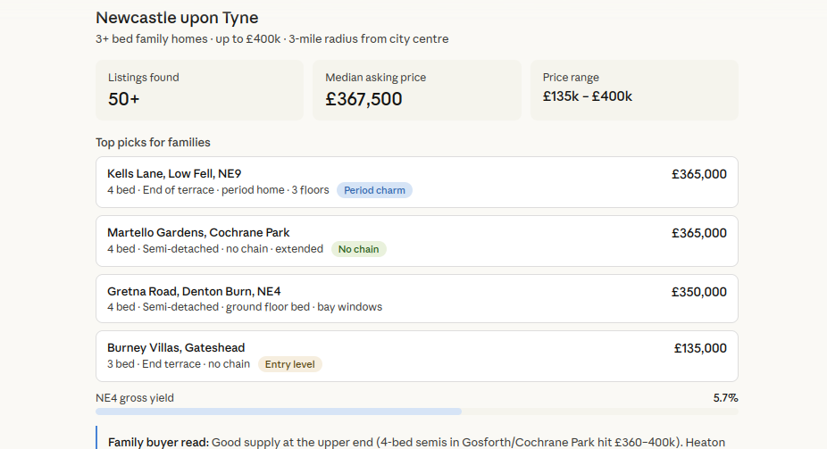

# BOUCH MCP Skills

Free Claude skills that connect to BOUCH MCP servers. Real UK data, not AI imagination.

Each skill is a SKILL.md file that tells Claude which tools to call, in what order, and how to present the results. Connect the MCP server, drop in the skill, go.



## Skills

### Property Quick Comps
Get comparable sales for any UK postcode. Median price, transaction count, price per sqft.

```json
{ "mcpServers": { "property": { "url": "https://property-shared.fly.dev/mcp" } } }
```

### Legislation Lookup
Search UK Acts of Parliament and read specific section text with in-force status and territorial extent.

```json
{ "mcpServers": { "uk-legal": { "url": "https://uk-legal-mcp.fly.dev/mcp" } } }
```

### P6 Quick Summary
Load a Primavera P6 XER file and get activity count, status breakdown, completion percentage.

```json
{ "mcpServers": { "pyp6xer": { "url": "https://pyp6xer-mcp.fly.dev/mcp" } } }
```

### Pine Function Lookup
Look up Pine Script v6 functions with correct signatures, parameters, and usage examples.

```json
{ "mcpServers": { "pinescript": { "url": "https://pinescript-mcp.fly.dev/mcp" } } }
```

## How to use

**Claude Code CLI:**
```bash
git clone https://github.com/paulieb89/bouch-mcp-skills.git
cp -r bouch-mcp-skills/property-quick-comps ~/.claude/skills/
```

**Claude.ai web:**
1. Settings > Customise > Add skill
2. Paste the SKILL.md content
3. Connect the MCP server (Settings > MCP Servers)

## MCP Servers

All servers are free, hosted on Fly.io. Source code:

- [property-shared](https://github.com/paulieb89/property-shared) — UK property data
- [uk-legal-mcp](https://github.com/paulieb89/uk-legal-mcp) — UK legal research
- [pyp6xer-mcp](https://github.com/paulieb89/pyp6xer-mcp) — P6 schedule analysis
- [pinescript-mcp](https://github.com/paulieb89/pinescript-mcp) — Pine Script v6 docs

## More skills (all free)

Full-workflow skills that use the same MCP servers:

- [Property Report Generator](https://bouch.dev/downloads/property-report/v1/SKILL.md) — comps, EPC, yield, stamp duty, price positioning, negotiation target
- [Deal Screener](https://bouch.dev/downloads/deal-screener/v1/SKILL.md) — BUY/WATCH/PASS decision with underwriting criteria
- [Rightmove Investment Finder](https://bouch.dev/downloads/rightmove-investment-finder/v1/SKILL.md) — investment analysis from a Rightmove URL
- [Property to Google Sheets](https://bouch.dev/downloads/property-to-sheets/v1/SKILL.md) — property report saved to a spreadsheet
- [Legal Research Brief](https://bouch.dev/downloads/legal-research/v1/SKILL.md) — case law, OSCOLA citations, Hansard, plain English summary
- [Policy Briefing](https://bouch.dev/downloads/policy-briefing/v1/SKILL.md) — parliamentary landscape, key MPs, reception assessment
- [P6 Health Check](https://bouch.dev/downloads/p6-health-check/v1/SKILL.md) — health score, critical path, float, logic quality, recommendations
- [P6 Earned Value](https://bouch.dev/downloads/p6-earned-value/v1/SKILL.md) — CPI, SPI, forecasts, WBS breakdown
- [Pine Strategy Builder](https://bouch.dev/downloads/pine-strategy-builder/v1/SKILL.md) — trading idea to validated v6 code
- [HMRC Tax & VAT](https://bouch.dev/downloads/hmrc-tax-vat/v1/SKILL.md) — VAT rates, MTD status, HMRC guidance

All skills at [bouch.dev/products](https://bouch.dev/products/)

## Licence

Apache 2.0