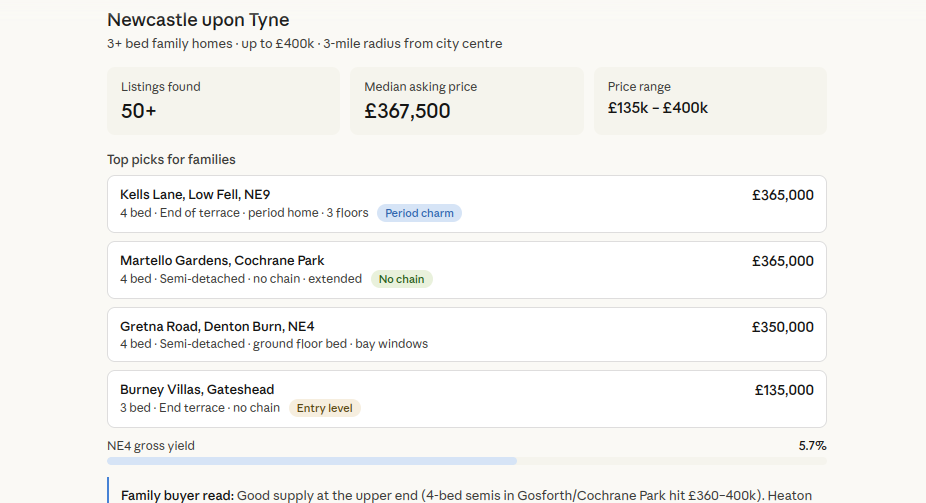

# BOUCH Skills

30 free Claude skills for UK professionals — property, legal, due diligence, P6 schedules, Pine Script, and general workflow utilities. Every skill is a SKILL.md file using Anthropic's agent skill standard (YAML frontmatter, `allowed-tools`, description-based matching).

Most MCP-backed skills connect to free BOUCH MCP servers for real UK data. Standalone skills run on any Claude (claude.ai, Claude Desktop, Claude Code) without infrastructure.



## Install

**Claude Code plugin (easiest):**
```
/plugin marketplace add paulieb89/bouch-plugins
/plugin install foundations@bouch-plugins
```

This installs a curated 10-skill pack. For individual skills, or to grab the full 31, use git clone below.

**Git clone (Claude Code manual):**
```bash
git clone https://github.com/paulieb89/bouch-mcp-skills.git
cp -r bouch-mcp-skills/property-report ~/.claude/skills/
```

**Claude.ai or Claude Desktop:**
1. Settings > Customise > Add skill (menu varies by version)
2. Paste the SKILL.md content
3. Connect the relevant MCP server under Settings > MCP Servers if the skill requires one

## Catalogue

### Property (8)

| Skill | What it does | MCP |
|---|---|---|
| [property-report](property-report/) | Full UK property analysis: comps, EPC, yield, stamp duty, negotiation target | property |
| [deal-screener](deal-screener/) | BUY/WATCH/PASS decision against underwriting criteria | property |
| [investment-summary](investment-summary/) | Client-ready investment report from an address or URL | property |
| [rightmove-investment-finder](rightmove-investment-finder/) | Investment analysis from a Rightmove URL | property |
| [rightmove-quick-search](rightmove-quick-search/) | Quick Rightmove search for a postcode | property |
| [property-quick-comps](property-quick-comps/) | Median price, sqft, transaction count for a postcode | property |
| [property-to-sheets](property-to-sheets/) | Property report saved into a Google Sheet | property + sheets |
| [reduced-listings](reduced-listings/) | Motivated-seller listings (recent price reductions) | property |

### Legal (6)

| Skill | What it does | MCP |
|---|---|---|
| [legal-research](legal-research/) | Full UK legal brief with OSCOLA citations, Hansard, plain-English summary | uk-legal |
| [policy-briefing](policy-briefing/) | Parliamentary landscape, key MPs, reception assessment | uk-legal |
| [legislation-lookup](legislation-lookup/) | Search Acts + retrieve sections with in-force status | uk-legal |
| [mp-dig](mp-dig/) | Hansard + interests + voting record on a given MP | uk-legal |
| [hmrc-tax-vat](hmrc-tax-vat/) | VAT rates, MTD status, HMRC guidance | uk-legal |
| [bailii-case-law](bailii-case-law/) | UK case law search + judgments (local STDIO MCP) | bailii |

### Due diligence (1)

| Skill | What it does | MCP |
|---|---|---|
| [company-check](company-check/) | Cross-register DD: Companies House + VAT + Charity + Gazette | uk-due-diligence |

### P6 schedule analysis (3)

| Skill | What it does | MCP |
|---|---|---|
| [p6-health-check](p6-health-check/) | Schedule health score, critical path, float, logic quality | pyp6xer |
| [p6-earned-value](p6-earned-value/) | CPI, SPI, forecasts, WBS breakdown | pyp6xer |
| [p6-quick-summary](p6-quick-summary/) | Activity count, status breakdown, completion % | pyp6xer |

### Pine Script trading (2)

| Skill | What it does | MCP |
|---|---|---|
| [pine-strategy-builder](pine-strategy-builder/) | Trading idea → validated Pine Script v6 code | pinescript |
| [pine-function-lookup](pine-function-lookup/) | Pine v6 function signatures, parameters, examples | pinescript |

### Research / cultural (2)

| Skill | What it does | MCP |
|---|---|---|
| [cultural-intelligence](cultural-intelligence/) | Agent-driven dossier on a creator, brand, or cultural figure | Web tools |
| [pitch-research](pitch-research/) | Research a UK company + draft a cold outreach email on evidence | uk-due-diligence + web |

### Voice & style (2)

| Skill | What it does | MCP |
|---|---|---|
| [humaniser](humaniser/) | Strip AI writing patterns (em dashes, hedges, filler) | none |
| [bouch-voice](bouch-voice/) | Apply BOUCH brand voice (wraps humaniser internally) | none |

### Workflow utilities (6)

| Skill | What it does | MCP |
|---|---|---|
| [workflow-auditor](workflow-auditor/) | Find where time actually gets lost in a repeated process | none |
| [client-prep](client-prep/) | Pre-meeting brief from prior notes and emails | none |
| [meeting-actions](meeting-actions/) | Meeting notes → owned, deadlined actions | none |
| [sop-writer](sop-writer/) | Described processes → structured SOPs | none |
| [thread-reply](thread-reply/) | Tone-adaptive replies for email or DM threads | none |
| [ai-policy](ai-policy/) | UK AI acceptable-use policy (GDPR, shadow AI) | none |

## MCP servers

All free, open source, hosted on Fly.io:

- [property-shared](https://github.com/paulieb89/property-shared) — Land Registry, EPC, Rightmove, planning
- [uk-legal-mcp](https://github.com/paulieb89/uk-legal-mcp) — legislation, case law, Hansard, MP data, HMRC
- [uk-due-diligence-mcp](https://github.com/paulieb89/uk-due-diligence-mcp) — Companies House, VAT, Charity, Gazette, Land Registry
- [bailii-mcp](https://github.com/paulieb89/bailii-mcp) — UK case law (local STDIO, BAILII blocks cloud IPs)
- [pyp6xer-mcp](https://github.com/paulieb89/pyp6xer-mcp) — Primavera P6 XER schedule analysis
- [pinescript-mcp](https://github.com/paulieb89/pinescript-mcp) — Pine Script v6 documentation
- [govuk-mcp](https://github.com/paulieb89/govuk-mcp) — GOV.UK content, organisations, postcode lookup

## Paid products

Free skills show you how. Paid Gumroad products ship them as packaged systems with a guide, playbook, and curated worked examples:

- **BOUCH Skills Foundations** (£39) — 30-page guide on writing your own skills + 10 curated worked examples + Claude Code plugin
- **UK Property Investor OS** (£49) — property workflow kit, launching week of 21 April
- **UK Legal Research OS** (£49) — legal workflow kit
- **UK Due Diligence OS** (£39) — DD workflow kit

Catalogue at [bouch.dev/products](https://bouch.dev/products/).

## Licence

Apache 2.0
